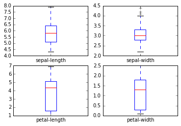
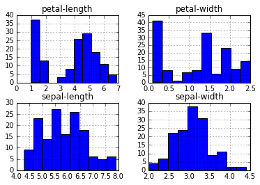
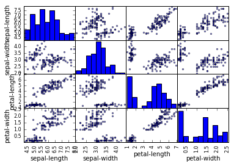
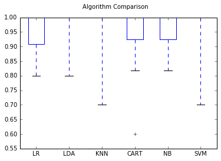

Hello All, This is my first machine learning experiment in Python and I am really excited to explore this path. In this post I will build a simple machine learning model using the popular [iris](https://archive.ics.uci.edu/ml/machine-learning-databases/iris/iris.data) data set availabel in the csv format.

### Loading libraries

Firstly, we will load all the required libraries for data manipulation, visualization and machine learning.


```python
# Load libraries
import pandas
from pandas.tools.plotting import scatter_matrix
import matplotlib.pyplot as plt
from sklearn import model_selection
from sklearn.metrics import classification_report
from sklearn.metrics import confusion_matrix
from sklearn.metrics import accuracy_score
from sklearn.linear_model import LogisticRegression
from sklearn.tree import DecisionTreeClassifier
from sklearn.neighbors import KNeighborsClassifier
from sklearn.discriminant_analysis import LinearDiscriminantAnalysis
from sklearn.naive_bayes import GaussianNB
from sklearn.svm import SVC
```

[Pandas](http://pandas.pydata.org/) is one of the most powerful packages available for Python to perform data structure manipulation and analysis. [Matplotlib](http://machinelearningmastery.com/machine-learning-in-python-step-by-step/) is widely used plotting library. [Scikit Learn](http://scikit-learn.org/stable/) is the machine learning library. All these libraries are open source and availabel from free download in the any python IDE.

### Loading the data

We will not load the and explore the data set.


```python
# Load dataset
url = "https://archive.ics.uci.edu/ml/machine-learning-databases/iris/iris.data"
names = ['sepal-length', 'sepal-width', 'petal-length', 'petal-width', 'class']
dataset = pandas.read_csv(url, names=names)
```


```python
dataset.shape
```


    (150, 5)


As we can observe the data set contains 150 rows and 5 columns. This also confirms that the data set is loaded successfully.


```python
type(dataset)
```


    pandas.core.frame.DataFrame


### Exploring the data

Now lets perform some descriptive statistics on the data set.

a . Print the top few rows


```python
dataset.head(5) # Equivalent to head() in R
```


<div>
<table border="1" class="dataframe">
  <thead>
    <tr style="text-align: right;">
      <th></th>
      <th>sepal-length</th>
      <th>sepal-width</th>
      <th>petal-length</th>
      <th>petal-width</th>
      <th>class</th>
    </tr>
  </thead>
  <tbody>
    <tr>
      <th>0</th>
      <td>5.1</td>
      <td>3.5</td>
      <td>1.4</td>
      <td>0.2</td>
      <td>Iris-setosa</td>
    </tr>
    <tr>
      <th>1</th>
      <td>4.9</td>
      <td>3.0</td>
      <td>1.4</td>
      <td>0.2</td>
      <td>Iris-setosa</td>
    </tr>
    <tr>
      <th>2</th>
      <td>4.7</td>
      <td>3.2</td>
      <td>1.3</td>
      <td>0.2</td>
      <td>Iris-setosa</td>
    </tr>
    <tr>
      <th>3</th>
      <td>4.6</td>
      <td>3.1</td>
      <td>1.5</td>
      <td>0.2</td>
      <td>Iris-setosa</td>
    </tr>
    <tr>
      <th>4</th>
      <td>5.0</td>
      <td>3.6</td>
      <td>1.4</td>
      <td>0.2</td>
      <td>Iris-setosa</td>
    </tr>
  </tbody>
</table>
</div>


b. Print the summary stats


```python
dataset.describe() # Equivalent to summary() in R
```


<div>
<table border="1" class="dataframe">
  <thead>
    <tr style="text-align: right;">
      <th></th>
      <th>sepal-length</th>
      <th>sepal-width</th>
      <th>petal-length</th>
      <th>petal-width</th>
    </tr>
  </thead>
  <tbody>
    <tr>
      <th>count</th>
      <td>150.000000</td>
      <td>150.000000</td>
      <td>150.000000</td>
      <td>150.000000</td>
    </tr>
    <tr>
      <th>mean</th>
      <td>5.843333</td>
      <td>3.054000</td>
      <td>3.758667</td>
      <td>1.198667</td>
    </tr>
    <tr>
      <th>std</th>
      <td>0.828066</td>
      <td>0.433594</td>
      <td>1.764420</td>
      <td>0.763161</td>
    </tr>
    <tr>
      <th>min</th>
      <td>4.300000</td>
      <td>2.000000</td>
      <td>1.000000</td>
      <td>0.100000</td>
    </tr>
    <tr>
      <th>25%</th>
      <td>5.100000</td>
      <td>2.800000</td>
      <td>1.600000</td>
      <td>0.300000</td>
    </tr>
    <tr>
      <th>50%</th>
      <td>5.800000</td>
      <td>3.000000</td>
      <td>4.350000</td>
      <td>1.300000</td>
    </tr>
    <tr>
      <th>75%</th>
      <td>6.400000</td>
      <td>3.300000</td>
      <td>5.100000</td>
      <td>1.800000</td>
    </tr>
    <tr>
      <th>max</th>
      <td>7.900000</td>
      <td>4.400000</td>
      <td>6.900000</td>
      <td>2.500000</td>
    </tr>
  </tbody>
</table>
</div>


c. Print the number of records in each class


```python
print(dataset.groupby('class').size()) # Equivalent to table() in R
```

    class
    Iris-setosa        50
    Iris-versicolor    50
    Iris-virginica     50
    dtype: int64
    

All the record are equally distributed across the classes.

d. Visualizing the data

Lets quickly visualize the box plots of the columns to better understand their distribution. 


```python
%matplotlib inline
dataset.plot(kind='box', subplots=True, layout=(2,2), sharex=False, sharey=False)
plt.show()
```





We can aswell see the histograme of these variables.


```python
dataset.hist()
plt.show()
```





sepal-show and sepal-width appear to be close to normally distributed.

Visualizing relationships between the variables


```python
scatter_matrix(dataset)
plt.show()
```





This plot suggests few variables are highyl correlated while others are not.

### Building simple models

Lets build a simple machine learning model to predict the class of the flower from the measurements.

Before we get started, I will enumerate the steps to pefrom

i. Split the datset in to 2 parts. One is the train data set and the other is the test dataset. 

ii. Build our models on the train dataset.

iii. Basis one of the chosen metrics like accuracy or [AUC (area under the curve)](https://en.wikipedia.org/wiki/Receiver_operating_characteristic#Area_under_the_curve) we will choose the best performing model. 

#### Step i : Splitting the data


```python
# Split-out validation dataset
array = dataset.values
X = array[:,0:4]
Y = array[:,4]

# 30% of the data will be used for testing
test_size = 0.30
seed = 123

# Splitting the X & Y arrays in to train and test arrays
X_train, X_test, Y_train, Y_test = model_selection.train_test_split(X, Y, test_size = test_size, random_state = seed)
```


```python
print(X_train.shape)
print(X_test.shape)
print(Y_train.shape)
print(Y_test.shape)
```

    (105, 4)
    (45, 4)
    (105,)
    (45,)
    

We have successfully split the datset in to train and test

#### Step ii.  Building Models

We will build 5 models using our train data.

* Logistic Regression (LR)

* Linear Discriminant Analysis (LDA)

* K-Nearest Neighbors (KNN)

* Classification and Regression Trees (CART)

* Gaussian Naive Bayes (NB)

* Support Vector Machines (SVM)

We will build each of the models using 10-fold cross validation. This means that the test data is split in to 10 parts. A model is built on the 9 parts and validated against the 1 part. Metrics like accuracy and AUC are computed. The process is repeated on all the 10 fold. Finally, the mean and standard deviation of the metric are computed which can then be compared with the respective metrics of other models. Cross validation gives us confidence about the model performance when used on the unseen data which is test data in our case.


```python
# Setting evlaution metric and folds
seed = 123
scoring = 'accuracy'
folds = 10

# Creating Algorithms
models = []
models.append(('LR', LogisticRegression()))
models.append(('LDA', LinearDiscriminantAnalysis()))
models.append(('KNN', KNeighborsClassifier()))
models.append(('CART', DecisionTreeClassifier()))
models.append(('NB', GaussianNB()))
models.append(('SVM', SVC()))
```


```python
# Building and evaluating models

# evaluate each model in turn
results = []
names = []
for name, model in models:
    kfold = model_selection.KFold(n_splits = folds, random_state=seed)
    cv_results = model_selection.cross_val_score(model, X_train, Y_train, cv=kfold, scoring=scoring)
    results.append(cv_results)
    names.append(name)
    msg = "%s: Avg. Accuracy = %f (SD = %f)" % (name, cv_results.mean(), cv_results.std())
    print(msg)
```

    LR: Avg. Accuracy = 0.951818 (SD = 0.065813)
    LDA: Avg. Accuracy = 0.970909 (SD = 0.063089)
    KNN: Avg. Accuracy = 0.960000 (SD = 0.091652)
    CART: Avg. Accuracy = 0.931818 (SD = 0.125128)
    NB: Avg. Accuracy = 0.961818 (SD = 0.062032)
    SVM: Avg. Accuracy = 0.960909 (SD = 0.091095)
    

### Step III. Choosing the best model 

We can observe that the best performing model is the LDA baed on the accuracy. We will use this model to against the tet data set.

We can visually compare the model performance using the boxplots as well.


```python
# Compare Algorithms
fig = plt.figure()
fig.suptitle('Algorithm Comparison')
ax = fig.add_subplot(111)
plt.boxplot(results)
ax.set_xticklabels(names)
plt.show()
```





## Making Predictions

Now that we have chose the best model, we will use it on the test data to predict the classes.


```python
# Make predictions on test dataset
lda = LinearDiscriminantAnalysis()
lda.fit(X_train, Y_train)
predictions = lda.predict(X_test)
print(accuracy_score(Y_test, predictions))
print(confusion_matrix(Y_test, predictions))
print(classification_report(Y_test, predictions))
```

    0.977777777778
    [[18  0  0]
     [ 0 10  0]
     [ 0  1 16]]
                     precision    recall  f1-score   support
    
        Iris-setosa       1.00      1.00      1.00        18
    Iris-versicolor       0.91      1.00      0.95        10
     Iris-virginica       1.00      0.94      0.97        17
    
        avg / total       0.98      0.98      0.98        45
    
    

We can very easily get all the metircs like accuracy, precision, confusion matrix, f1 scores etc  using simple function in the sci-kit learn package.

The final accuracy we got is close to 98%. This is also consistant with the summary of the cross validation report. Hence we can be some what assured that this model is stable and we can expect similar results when used against outside data.

## Conclusion

This is the end of my first experiment building models with Python. Watch out this space for more real world experiements. Please do leave a comment below.
